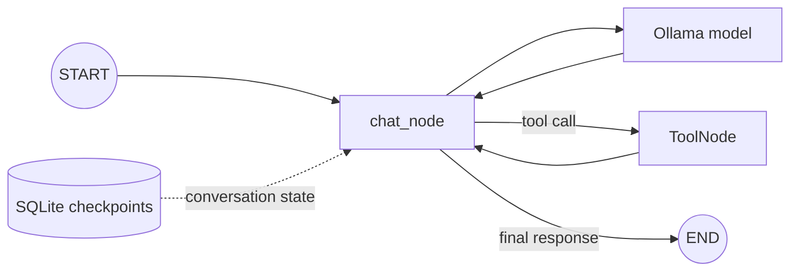

# LangGraph Agentic Chatbot

A small learning project that demonstrates how to build a stateful command-line
chatbot with [LangGraph](https://langchain-ai.github.io/langgraph/) and a local
[Ollama](https://ollama.com/) model. The implementation lives in a Jupyter
notebook so each part of the workflow can be explored interactively.

## What this project demonstrates

- Defining a typed graph state containing a conversation's messages
- Using LangGraph's `add_messages` reducer to append chat history
- Calling a local model through `ChatOllama`
- Letting the model call web-search, calculator, stock-price, and weather tools
- Persisting conversation checkpoints in SQLite
- Monitoring LangGraph runs with a self-hosted Langfuse instance

## Workflow



The graph invokes the configured Ollama model and appends its response to the
message state. `tools_condition` routes tool calls through `ToolNode`; ordinary
model responses end the run. SQLite checkpoints preserve state for subsequent
calls using the same `thread_id`.

## Prerequisites

- Python 3.14 or later
- [uv](https://docs.astral.sh/uv/)
- [Ollama](https://ollama.com/) running locally
- The model configured in `.env` (the default is `gemma4:e2b`)

## Setup

1. Clone the repository and enter its directory.

2. Install the locked dependencies:

   ```bash
   uv sync
   ```

3. Create your local environment file:

   ```bash
   cp .env.example .env
   ```

4. Download the configured model and make sure Ollama is running:

   ```bash
   ollama pull gemma4:e2b
   ollama serve
   ```

   If Ollama is already running as a service, you do not need to run
   `ollama serve` again.

5. Open the notebook:

   ```bash
   uv run jupyter lab src/langgraph_agentic_chatbot/chatbot-workflow.ipynb
   ```

   You can also select the project's virtual environment as the kernel in VS
   Code or another notebook editor.

Run the cells in order. In the interactive chat cell, enter `exit`, `quit`, or
`bye` to stop the loop.

## Configuration

The notebook reads these optional values from `.env`:

| Variable | Default | Purpose |
| --- | --- | --- |
| `OLLAMA_MODEL` | `gemma4:e2b` | Ollama model used for responses |
| `OLLAMA_BASE_URL` | `http://localhost:11434` | URL of the Ollama server |
| `LANGFUSE_PUBLIC_KEY` | unset | Public key for your Langfuse project |
| `LANGFUSE_SECRET_KEY` | unset | Secret key for your Langfuse project |
| `LANGFUSE_BASE_URL` | `http://localhost:3000` | URL of your self-hosted Langfuse instance |
| `LANGFUSE_TRACING_ENVIRONMENT` | `development` | Environment label attached to traces |

To use another local model, pull it with Ollama and update `OLLAMA_MODEL`.

## Self-hosted Langfuse monitoring

This repository includes a single-node Docker Compose server in `langfuse/`.
It runs the Langfuse web app and worker with PostgreSQL, ClickHouse, Redis, and
MinIO volumes. It is appropriate for local development, not high availability.

1. Copy the server configuration and replace every `CHANGE_ME` value with a
   different random secret:

   ```bash
   cp langfuse/.env.example langfuse/.env
   openssl rand -hex 32
   ```

2. Start the server:

   ```bash
   docker compose --env-file langfuse/.env -f langfuse/docker-compose.yml up -d
   ```

3. Wait for the web container to become ready, open `http://localhost:3000`,
   create an organization and project, then copy its public and secret keys
   into the application's `.env`. Keep `LANGFUSE_BASE_URL=http://localhost:3000`.

To stop the server without deleting trace data:

```bash
docker compose --env-file langfuse/.env -f langfuse/docker-compose.yml down
```

When enabled, every `chatbot.invoke(...)` run records the LangGraph execution,
model calls, and tool calls. Langfuse receives prompts and tool outputs, so do
not send secrets or other sensitive user data unless your self-hosted deployment
and retention policy are designed for it. Call `flush_observability()` before a
short-lived script exits to send any queued events.

## Project structure

```text
.
├── .env.example
├── .python-version
├── pyproject.toml
├── uv.lock
└── src/
    └── langgraph_agentic_chatbot/
        ├── __init__.py
        └── chatbot-workflow.ipynb
```

## Notes

- `MemorySaver` stores checkpoints only in process memory; conversation history
  is lost when the notebook kernel stops.
- Reusing a `thread_id` continues its saved conversation. Use a different ID
  for an independent conversation.
- The project uses a local Ollama server, so no hosted-model API key is needed.
- `.env` is ignored by Git; commit only `.env.example`.
