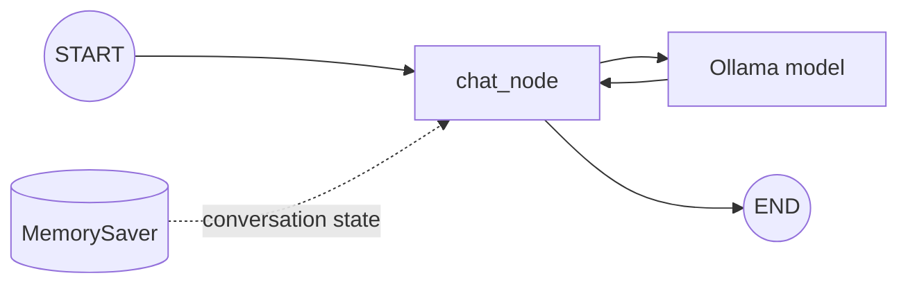

# LangGraph Agentic Chatbot

A small learning project that demonstrates how to build a stateful command-line
chatbot with [LangGraph](https://langchain-ai.github.io/langgraph/) and a local
[Ollama](https://ollama.com/) model. The implementation lives in a Jupyter
notebook so each part of the workflow can be explored interactively.

## What this project demonstrates

- Defining a typed graph state containing a conversation's messages
- Using LangGraph's `add_messages` reducer to append chat history
- Calling a local model through `ChatOllama`
- Connecting a chat node between LangGraph's `START` and `END` nodes
- Preserving conversation context with an in-memory checkpointer and thread ID
- Inspecting the saved graph state after a conversation

## Workflow



The graph has one application node. It receives the accumulated message list,
invokes the configured Ollama model, and appends the model response to the
state. `MemorySaver` keeps that state for subsequent calls using the same
`thread_id`.

## Prerequisites

- Python 3.14 or later
- [uv](https://docs.astral.sh/uv/)
- [Ollama](https://ollama.com/) running locally
- The model configured in `.env` (the default is `gemma4:e2b`)

## Setup

1. Clone the repository and enter its directory.

2. Install the locked dependencies:

   ```bash
   uv sync
   ```

3. Create your local environment file:

   ```bash
   cp .env.example .env
   ```

4. Download the configured model and make sure Ollama is running:

   ```bash
   ollama pull gemma4:e2b
   ollama serve
   ```

   If Ollama is already running as a service, you do not need to run
   `ollama serve` again.

5. Open the notebook:

   ```bash
   uv run jupyter lab src/langgraph_agentic_chatbot/chatbot-workflow.ipynb
   ```

   You can also select the project's virtual environment as the kernel in VS
   Code or another notebook editor.

Run the cells in order. In the interactive chat cell, enter `exit`, `quit`, or
`bye` to stop the loop.

## Configuration

The notebook reads these optional values from `.env`:

| Variable | Default | Purpose |
| --- | --- | --- |
| `OLLAMA_MODEL` | `gemma4:e2b` | Ollama model used for responses |
| `OLLAMA_BASE_URL` | `http://localhost:11434` | URL of the Ollama server |

To use another local model, pull it with Ollama and update `OLLAMA_MODEL`.

## Project structure

```text
.
├── .env.example
├── .python-version
├── pyproject.toml
├── uv.lock
└── src/
    └── langgraph_agentic_chatbot/
        ├── __init__.py
        └── chatbot-workflow.ipynb
```

## Notes

- `MemorySaver` stores checkpoints only in process memory; conversation history
  is lost when the notebook kernel stops.
- Reusing a `thread_id` continues its saved conversation. Use a different ID
  for an independent conversation.
- The project uses a local Ollama server, so no hosted-model API key is needed.
- `.env` is ignored by Git; commit only `.env.example`.